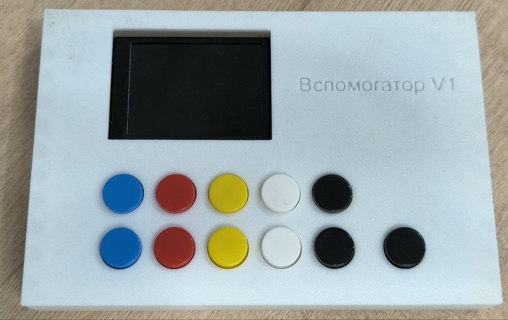
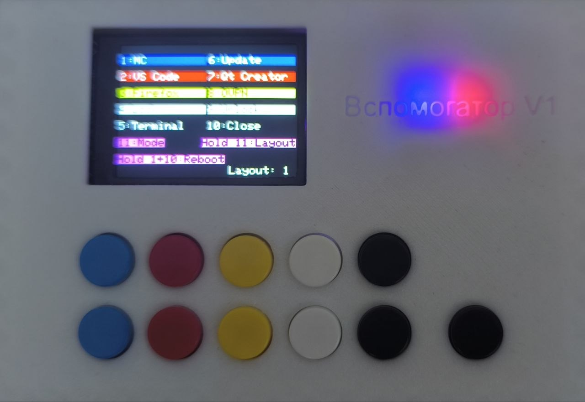
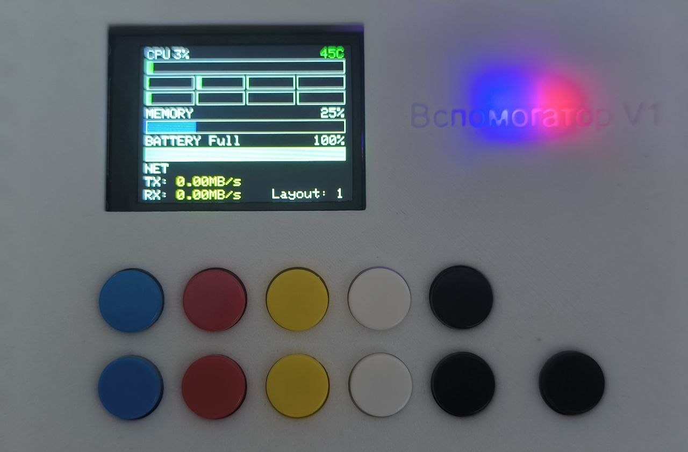
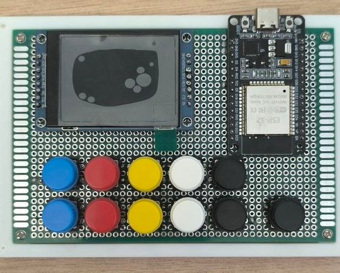

**Языки**  
* [English](README.md)
* [Русский](README-RU.md)

## Описание  
**Вспомогатор** — это программируемая макроклавиатура с дисплеем, которая подключается к компьютеру по USB (через виртуальный COM-порт). Устройство позволяет выполнять команды, имитировать ввод текста или нажатие сочетаний клавиш. Кнопки сгруппированы в раскладки (Layouts), а на экране отображается либо текущая раскладка, либо системная информация (загрузка и температура ЦПУ, использование ОЗУ, активность сети, статус батареи). Всего 11 кнопок. Кнопки нумеруются от 1 до 11 слева-направо, сверху-вниз.  
## Возможности
- **Два режима отображения**:
  - **Режим раскладки**: показывает названия кнопок в соответствии с файлом конфигурации.  
  
  - **Режим системной информации**: отображает загрузку ЦПУ (общую и по ядрам), использование ОЗУ, температуру ЦПУ, активность сети (Tx/Rx) и статус батареи.  
  
- **Переключение режима** осуществляется нажатием на кнопку 11.  
- **Смена раскладки** осуществляется долгим нажатием на кнопку 11.  
- **Перезагрузка** осуществляется долгим нажатием кнопок 1 + 10.  
## Использованные материалы  
- **ESP32** DevKitV1 с чипом CP2102 - какой-то китайский клон. https://ozon.ru/t/zLtqDSa
- **TFT LCD дисплей 240x320** на контроллере ST7789. https://ozon.ru/t/WcsNvLD
- **11 тактовых кнопок** https://ozon.ru/t/3Qol6bx
- **макетная плата** 12x8 https://ozon.ru/t/QWNoiOu
- **провода**
- **гребёнки**. В комплекте к дисплею идёт гребёнка только на одну сторону. https://ozon.ru/t/dwWQEG1
- **корпус** напечатан на 3d-принтере. Модели в директории *3d models*
## Распиновка  
### Дисплей  
| ESP32 | ST7789 |
|-------|--------|
| 3V3   | VDD,BL |
| GND   | GND    |
| D2    | DC     |
| D4    | RES    |
| D5    | CS     |
| D18   | SCL    |
| D23   | SDA    |
### Кнопки  
По одному пину каждой кнопки подключено к GND ESP32. 2-ые пины:
| ESP32   | Кнопка |
|---------|--------|
| D13     | 1      |
| D14     | 2      |
| D16(RX2)| 3      |
| D17(TX2)| 4      |
| D19     | 5      |
| D21     | 6      |
| D22     | 7      |
| D25     | 8      |
| D26     | 9      |
| D27     | 10     |
| D33     | 11     |
## Расположение элементов  
Если вы хотите напечатать такой же корпус, необходимо расположить элементы на макетной плате в точности, как на фото:  

## Софт  
### Прошивка ESP32  
- В Arduino IDE выбирайте плату **ESP32 Dev Module**.
- Устанавливаете библиотеки **TFT_eSPI**, **EncButton**, **ArduinoJson**.
- В библиотеке **TFT_eSPI** в файле *UserSetup.h* (у меня на linux он по пути *~/Arduino/libraries/TFT_eSPI/User_Setup.h*) меняете дефайны, как в файле User_Setup.h в этом репозитории. Или просто замените файл.
- Прошиваете ESP32.
### Сервис  
#### Требования  
Из коробки будет работать только на linux. Для Windows нужно допиливать.  
#### Установка  
В релизах есть собранный бинарник под linux x86_64 и deb-пакет.  
Так же есть юнит-файл systemd в *service/buildscripts/vspomogator.service*. При установке deb-пакета systemd-сервис установится и активируется автоматически, конфиг будет по пути */etc/vspomogator/vspomogator.yml*.  
#### Самостоятельная сборка  
Должен быть установлен компилятор go. В директории *service* запустите:

```
make
```

Для сборки deb-пакета должен быть установлен [fpm](https://github.com/jordansissel/fpm). В директории с исходниками запускаем:

```
make deb
```

Бинарник и deb-пакет появятся в директории *build*.  
#### Аргументы командной строки  

```
Usage: vspomogator [-c config] [-h] [-v]
  -c string
    	Path to config (default "vspomogator.yml")
  -h	Show this help
  -v	Show version
```

#### Файл конфигурации  

```
port: /dev/ttyUSB0                     # Порт, к которому подключена ESP32. Можно найти в /dev/. Обычно это /dev/ttyUSB0
layouts:
  - buttons:                           # Первая раскладка (Layout 1)
    - label: MC                        # Надпись на экране
      type: command                    # Тип действия (command - команда, keytype - клавиатурный ввод, keyseq - комбинация клавиш клавиатуры. По умолчанию command)
      command:
        com: terminator                # Команда для запуска
        args: [-e, mc]                 # Аргументы команды
    - label: Close
      type: keyseq                     # Комбинация клавиш
      command:
        com: "f4"                      # Основная клавиша
        args: ["alt"]                  # Модификаторы
    - label: Hello
      type: keytype                    # Клавиатурный ввод
      command:
        com: Hello, world!             # Текст для ввода
        hitenter: true                 # Нажимать ли enter после ввода
  - buttons:                           # Вторая раскладка (Layout 2)
    ...
```

Модификаторы и клавиши для комбинаций смотрите [здесь](https://github.com/go-vgo/robotgo/blob/master/docs/keys.md)